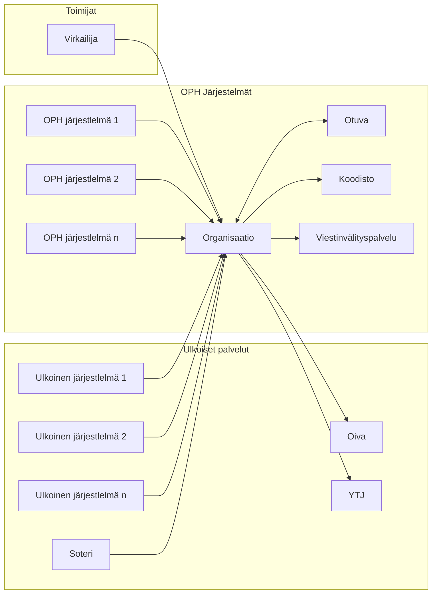

# Integraatiot

```mermaid


flowchart LR
    subgraph Ulkoiset palvelut
        ulkoiset_jarjestelmat_1[Ulkoinen järjestlelmä 1]
        ulkoiset_jarjestelmat_2[Ulkoinen järjestlelmä 2]
        ulkoiset_jarjestelmat_n[Ulkoinen järjestlelmä n]
        Oiva
        YTJ
        Soteri
    end
    subgraph Toimijat
        Virkailija
    end
    subgraph OPH Järjestelmät
        Organisaatio
        Otuva
        Koodisto
        Viestinvälityspalvelu
        muut_jarjestelmat_1[OPH järjestlelmä 1]
        muut_jarjestelmat_2[OPH järjestlelmä 2]
        muut_jarjestelmat_n[OPH järjestlelmä n]
    end
    Virkailija --> Organisaatio 
    Organisaatio <--> Otuva
    Organisaatio --> Koodisto 
    Organisaatio --> Viestinvälityspalvelu
    muut_jarjestelmat_1 --> Organisaatio
    muut_jarjestelmat_2 --> Organisaatio
    muut_jarjestelmat_n --> Organisaatio
    ulkoiset_jarjestelmat_1 --> Organisaatio
    ulkoiset_jarjestelmat_2 --> Organisaatio
    ulkoiset_jarjestelmat_n --> Organisaatio
    Organisaatio --> Oiva
    Organisaatio --> YTJ
    Soteri --> Organisaatio
```